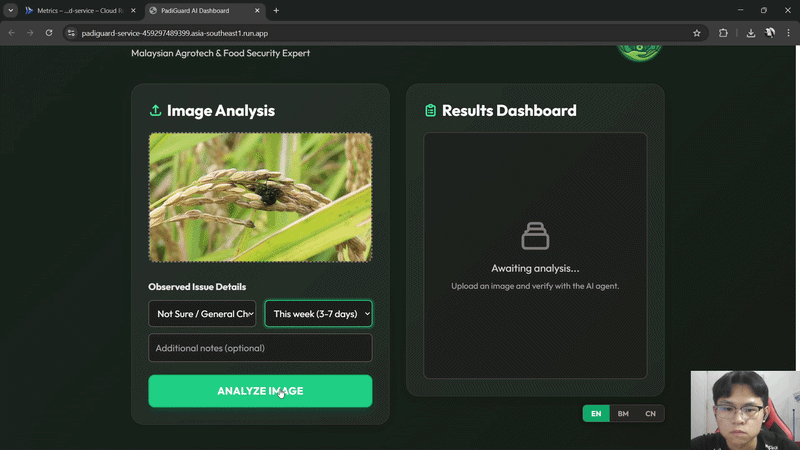
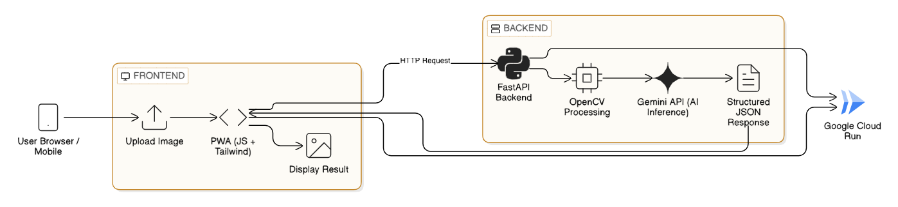
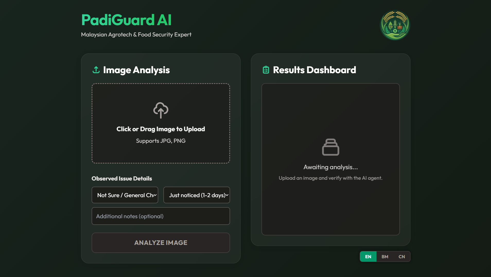
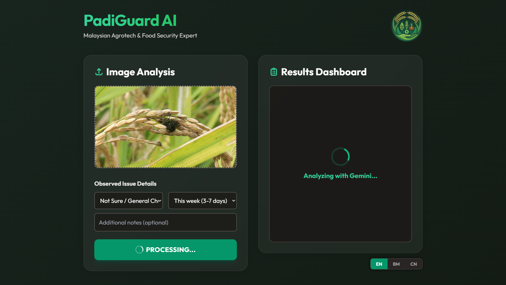
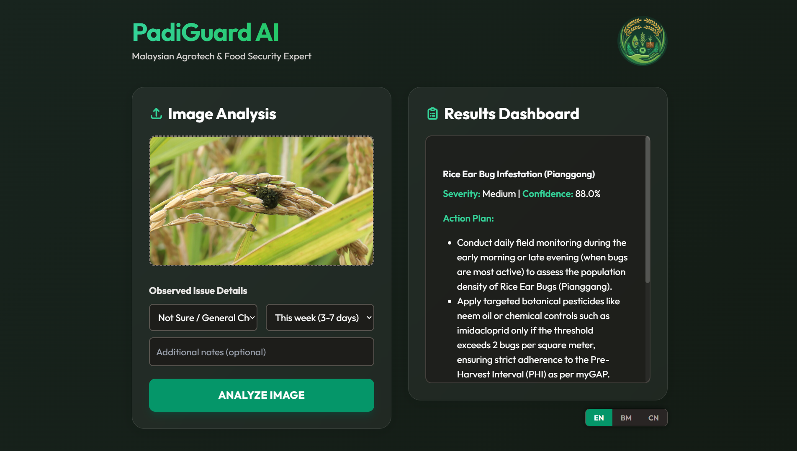

# 🌾 PadiGuard AI
> **Project 2030 MyAI Future Hackathon** | **Track 1: Padi & Plates (Agrotech & Food Security)**

PadiGuard AI is an intelligent, low-latency crop disease diagnosis system designed for Malaysian farmers, enabling instant plant health detection and localized remedy suggestions using Agentic AI.

It aims to improve food security, reduce crop loss, and empower farmers with AI-driven decision support.

🔗 **Live Deployment:** [https://padiguard-service-459297489399.asia-southeast1.run.app/](https://padiguard-service-459297489399.asia-southeast1.run.app/)

---

## 🤖 AI Disclosure
This project natively integrates **Google Gemini 3 Flash** for rapid computer vision and diagnostic reasoning. Model behavior is sculpted using **Google AI Studio** for precise prompt engineering and structured agentic outputs.

---

## 🎥 Demo & System Overview
### 📌 Live Demo
)

### 🏗️ System Architecture


### 📱 UI Preview

 


## 🧠 Technical Execution & Key Features
### 🌱 AI Crop Disease Detection
- Powered by Google Gemini 3 Flash
- Image-based plant disease classification
- Structured diagnostic output (no hallucination via schema enforcement)

### ⚡ Fast Image Optimization Pipeline
- OpenCV preprocessing (resize, denoise, CLAHE, sharpening)
- Reduced latency & API cost
- Enhanced feature visibility for leaf analysis

### 🌐 Multilingual AI (EN / BM / 中文)
- Dynamic language switching
- Backend prompt adapts to user language
- Farmer-friendly localized responses

### 🛡️ Agentic AI Safety Layer
- Strict JSON schema via Pydantic
- Rejects invalid/non-plant images
- Guided input system to improve prediction accuracy

## 🛠 Tech Stack
- **AI Engine:** Google Gemini 3 Flash API
- **Backend:** FastAPI, Uvicorn, Pydantic, OpenCV, NumPy
- **Frontend:** HTML5, Tailwind CSS, Vanilla JS, marked.js
- **Deployment:** Google Cloud Run

---

## 🚀 How to Run Locally

### 1️⃣ Backend Setup
1. Open a terminal and navigate to the backend folder:
   ```bash
   cd backend
   ```
2. Install the required Python dependencies:
   ```bash
   pip install -r requirements.txt
   ```
3. Create a `.env` file in the `backend` directory and add your API key:
   ```env
   GEMINI_API_KEY="your_google_gemini_api_key_here"
   ```
4. Start the FastAPI server:
   ```bash
   uvicorn main:app --reload --host 0.0.0.0
   ```
   > **Note:** The backend will run on **http://localhost:8000**. Built-in API documentation is available at **http://localhost:8000/docs**.

### 2️⃣ Frontend Setup
1. Open a **new, separate terminal window** and navigate to the frontend folder:
   ```bash
   cd frontend
   ```
2. Start the local HTTP server:
   ```bash
   python -m http.server 3000
   ```
3. Open your browser and navigate to **http://localhost:3000** to use the PadiGuard AI Dashboard.

---

## 🧩 Project Impact
PadiGuard AI demonstrates how Agentic AI + Computer Vision + Edge Optimization can be applied in agriculture to:
- Reduce crop disease detection time
- Improve farming decision accuracy
- Support Malaysia’s agricultural digital transformation
